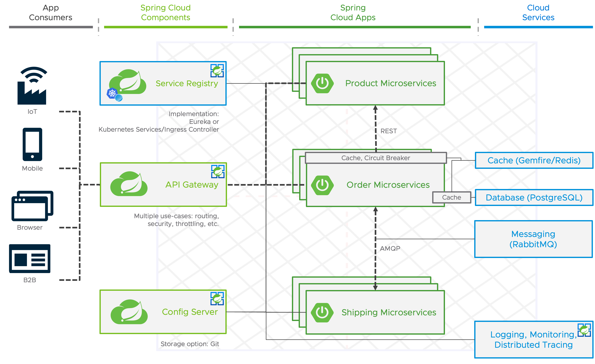

# Azure Spring Apps Standard vs Azure Spring Apps Enterprise

A demonstration of the capabilities of Azure Spring Apps Standard and Enterprise.

[Slides](asa-overview.pdf)

The demo application is a typical microservice application for a supply chain. 
The product microservice only has one REST endpoint to fetch the list of products and products are configurable via configuration properties.
With the order service REST API, clients are able to fetch the current orders that are stored in a relational database and they are also able to create new orders.
The product id for a new order is validated with the list of products that will be fetched from the product service via a synchronous REST call.
After the order is created and stored in the database, information like the shipping address will be sent to the shipping service via asynchronous messaging and after a configurable amount of time (for example 10 seconds) a status update for the DELIVERY will be sent back via asynchronous messaging to be consumed by the order microservice.



## TODO
- Create walkthroughs to discover all the features of ASA(-E) with the deployed application

## Azure Spring Apps Standard

### Deployment

#### Create backing service instances
```
POSTGRES_PW=<your-postgres-password>
az postgres server create -n sc-arch-postgres-server -g sc-arch -l germanywestcentral --sku-name B_Gen5_1 -u developer -p $POSTGRES_PW
az postgres db create -n order-db -s sc-arch-postgres-server -g sc-arch 
az redis create -n sc-arch-cache -g sc-arch -l germanywestcentral --sku Basic --vm-size c0
az servicebus namespace create -n sc-arch-bus -g sc-arch -l germanywestcentral --sku Basic
az servicebus queue create -n order-shipping-queue -g sc-arch --namespace-name sc-arch-bus
az servicebus queue create -n order-delivered-queue -g sc-arch --namespace-name sc-arch-bus 
```

#### Create application configuration
```
az spring app create -s sc-arch -g sc-arch -n product-service --env 
az spring app create -s sc-arch -g sc-arch -n order-service
az spring app create -s sc-arch -g sc-arch -n shipping-service
az spring app create -s sc-arch -g sc-arch -n gateway
az spring app create -s sc-arch -g sc-arch -n frontend --env PORT=1025
```
#### Connect application to backing services
```
az spring connection create redis -g sc-arch --tg sc-arch --service sc-arch --app order-service --server sc-arch-cache --database 0 --client-type springBoot --deployment default
az spring connection create postgres -g sc-arch --tg sc-arch --service sc-arch --app order-service --server sc-arch-e-postgres-server --database order-db --client-type springBoot --secret name=developer secret=$POSTGRES_PW --deployment default
az spring connection create servicebus -g sc-arch --tg sc-arch --service sc-arch --app order-service --namespace sc-arch-bus --client-type springBoot --deployment default
az spring connection create servicebus -g sc-arch --tg sc-arch --service sc-arch --app shipping-service --namespace sc-arch-bus --client-type springBoot --deployment default
```

#### Configure Config Server
```
az spring config-server git set -g sc-arch -n sc-arch --uri https://github.com/timosalm/sc-arch-asa.git --search-paths config-server-configuration --label main
```

#### Deploy application
```
(cd product-service && az spring app deploy -s sc-arch -g sc-arch -n product-service --runtime-version Java_17 --source-path)
(cd order-service && az spring app deploy -s sc-arch -g sc-arch -n order-service --runtime-version Java_17 --source-path)
(cd shipping-service && az spring app deploy -s sc-arch -g sc-arch -n shipping-service --runtime-version Java_17 --source-path)
(cd gateway && az spring app deploy -s sc-arch -g sc-arch -n gateway --runtime-version Java_17 --assign-endpoint --source-path)
az spring app deploy -s sc-arch -g sc-arch -n frontend --container-image tap-workshops/frontend-optional-auth --container-registry harbor.main.emea.end2end.link
```

### Validate that the deployed application is working

#### Via browser
Open the output of the following command in your browser.
```
echo "$(az spring app show -s sc-arch -g sc-arch -n gateway | jq -r .properties.url)/frontend/"
```
#### Via curl
```
GATEWAY_URL=$(az spring app show -s sc-arch -g sc-arch -n gateway | jq -r .properties.url)
curl $GATEWAY_URL/services/product-service/api/v1/products
curl $GATEWAY_URL/services/order-service/api/v1/orders
curl -X POST -H "Content-Type: application/json" -d '{"productId":"1", "shippingAddress": "Stuttgart"}' $GATEWAY_URL/services/order-service/api/v1/orders
curl $GATEWAY_URL/services/order-service/api/v1/orders
```

After a few seconds, the status of your created order should change to `DELIVERED`.

### Secure your application 

#### Create an App registration in Microsoft Entra
Go to the [Microsoft Entra admin center](https://entra.microsoft.com/) or access the Microsoft Entra service from your [Azure portal](https://portal.azure.com/).

Browse to `Identity > Applications > App registrations`, and click on `New registration`.
- Fill out the Name (e.g. `asa-sc-arch`)
- For the Redirect URI field, choose `Web` as the platform. Run the following command to get the base URL for the Redirect URI `az spring app show -s sc-arch -g sc-arch -n gateway | jq -r .properties.url`, and add `/login/oauth2/code/sso` to it (e.g. https://sc-arch-gateway.azuremicroservices.io/login/oauth2/code/sso).
- Click on `Register`

Note the `Application (client) ID` on your just created App registration's Overview dashboard.

To create a client secret:
- Select Certificates & secrets
- Select Client secrets, then select New client secret.
- Enter a description for the client secret, then set an expiration date.
- Click on `Add`
- Note the `Value`

Go back to `Identity > Applications > App registrations`, and click on `Endpoints`. Note the `OpenID Connect metadata document` endpoint without the `/.well-known/openid-configuration` suffix as the issuer host (.e.g https://login.microsoftonline.com/29242f74-371f-4db2-2a50-c62b6877a0c1/v2.0).

```
export ISSUER_URI=
export CLIENT_ID=
export CLIENT_SECRET=
```

#### Update application configuration

We will set the required configurations with environment variables, as they are different for any user. If you have set up your own non-public Git repository for the configuration service, I recommend setting them there.

```
az spring app update -s sc-arch -g sc-arch -n product-service --env SPRING_PROFILES_ACTIVE=oauth SPRING_SECURITY_OAUTH2_RESOURCESERVER_JWT_ISSUER-URI=$ISSUER_URI
az spring app update -s sc-arch -g sc-arch -n order-service --env SPRING_PROFILES_ACTIVE=oauth SPRING_SECURITY_OAUTH2_RESOURCESERVER_JWT_ISSUER-URI=$ISSUER_URI
az spring app update -s sc-arch -g sc-arch -n gateway --env SPRING_PROFILES_ACTIVE=oauth GATEWAY_OAUTH_ISSUER-URI=$ISSUER_URI GATEWAY_OAUTH_CLIENT-ID=$CLIENT_ID GATEWAY_OAUTH_CLIENT-SECRET=$CLIENT_SECRET
```

#### Validate that the deployed application is working
Open the output of the following command in your browser.
```
echo "https://$(az spring gateway show -s sc-arch -g sc-arch | jq -r .properties.url)/frontend/"
```

## Azure Spring Apps Enterprise

### Deployment

#### Create backing service instances
```
POSTGRES_PW=<your-postgres-password>
az postgres server create -n sc-arch-e-postgres-server -g sc-arch-e -l germanywestcentral --sku-name B_Gen5_1 -u developer -p $POSTGRES_PW
az postgres db create -n order-db -s sc-arch-e-postgres-server -g sc-arch-e 
az redis create -n sc-arch-e-cache -g sc-arch-e -l germanywestcentral --sku Basic --vm-size c0
az servicebus namespace create -n sc-arch-e-bus -g sc-arch-e -l germanywestcentral --sku Basic
az servicebus queue create -n order-shipping-queue -g sc-arch-e --namespace-name sc-arch-e-bus
az servicebus queue create -n order-delivered-queue -g sc-arch-e --namespace-name sc-arch-e-bus 
```

#### Create application configuration
```
az spring app create -s sc-arch-e -g sc-arch-e -n product-service
az spring app create -s sc-arch-e -g sc-arch-e -n order-service
az spring app create -s sc-arch-e -g sc-arch-e -n shipping-service
az spring app create -s sc-arch-e -g sc-arch-e -n frontend --env PORT=8080
```
#### Connect application to backing services
```
az spring connection create redis -g sc-arch-e --tg sc-arch-e --service sc-arch-e --app order-service --server sc-arch-e-cache --database 0 --client-type springBoot --deployment default
az spring connection create postgres -g sc-arch-e --tg sc-arch-e --service sc-arch-e --app order-service --server sc-arch-e-postgres-server --database order-db --client-type springBoot --secret name=developer secret=$POSTGRES_PW --deployment default
az spring connection create servicebus -g sc-arch-e --tg sc-arch-e --service sc-arch-e --app order-service --namespace sc-arch-e-bus --client-type springBoot --deployment default
az spring connection create servicebus -g sc-arch-e --tg sc-arch-e --service sc-arch-e --app shipping-service --namespace sc-arch-e-bus --client-type springBoot --deployment default
```

#### Configure Application Configuration Service
```
az spring application-configuration-service git repo add -g sc-arch-e -s sc-arch-e -n default --uri https://github.com/timosalm/sc-arch-asa.git --search-paths config-server-configuration --label main --patterns product-service,order-service,shipping-service
az spring application-configuration-service bind -g sc-arch-e -s sc-arch-e --app product-service
az spring application-configuration-service bind -g sc-arch-e -s sc-arch-e --app order-service
az spring application-configuration-service bind -g sc-arch-e -s sc-arch-e --app shipping-service
az spring app update -s sc-arch-e -g sc-arch-e -n product-service --config-file-patterns product-service
az spring app update -s sc-arch-e -g sc-arch-e -n order-service --config-file-patterns order-service
az spring app update -s sc-arch-e -g sc-arch-e -n shipping-service --config-file-patterns shipping-service
```

#### Bind application to Service Registry
```
az spring service-registry bind -g sc-arch-e -s sc-arch-e --app product-service
az spring service-registry bind -g sc-arch-e -s sc-arch-e --app order-service
az spring service-registry bind -g sc-arch-e -s sc-arch-e --app shipping-service
```

#### Deploy application
```
(cd product-service && az spring app deploy -s sc-arch-e -g sc-arch-e -n product-service --build-env BP_JVM_VERSION=17 --source-path)
(cd order-service && az spring app deploy -s sc-arch-e -g sc-arch-e -n order-service --build-env BP_JVM_VERSION=17 --source-path)
(cd shipping-service && az spring app deploy -s sc-arch-e -g sc-arch-e -n shipping-service --build-env BP_JVM_VERSION=17 --source-path)
az spring app deploy -s sc-arch-e -g sc-arch-e -n frontend --container-image tap-workshops/frontend-optional-auth --container-registry harbor.main.emea.end2end.link
```

If you would like to build a container for the frontend yourself, run the following commands. Due to an issue with the current default builder, we create a custom one that only includes the `tanzu-buildpacks/web-servers`.
```
az spring build-service builder create -s sc-arch-e -g sc-arch-e -n frontend --builder-file frontend-builder.json
(cd frontend && az spring app deploy -s sc-arch-e -g sc-arch-e -n frontend --build-env BP_NODE_RUN_SCRIPTS=build BP_WEB_SERVER_ROOT=dist/frontend BP_WEB_SERVER_ENABLE_PUSH_STATE=true BP_WEB_SERVER=nginx NODE_ENV=production --builder=frontend --source-path)
```

#### Configure Spring Cloud Gateway
```
az spring gateway update -s sc-arch-e -g sc-arch-e --assign-endpoint true --https-only true --properties spring.codec.max-in-memory-size=-1
az spring gateway route-config create -s sc-arch-e -g sc-arch-e -n order-service --app-name order-service --routes-file gateway-route-order-service.json
az spring gateway route-config create -s sc-arch-e -g sc-arch-e -n product-service --app-name product-service --routes-file gateway-route-product-service.json
az spring gateway route-config create -s sc-arch-e -g sc-arch-e -n frontend --app-name frontend --routes-file gateway-route-frontend.json
```

### Validate that the deployed application is working

#### Via browser
Open the output of the following command in your browser.
```
echo "https://$(az spring gateway show -s sc-arch-e -g sc-arch-e | jq -r .properties.url)/frontend/"
```
#### Via curl
```
GATEWAY_URL=https://$(az spring gateway show -s sc-arch-e -g sc-arch-e | jq -r .properties.url)
curl $GATEWAY_URL/services/product-service/api/v1/products
curl $GATEWAY_URL/services/order-service/api/v1/orders
curl -X POST -H "Content-Type: application/json" -d '{"productId":"1", "shippingAddress": "Stuttgart"}' $GATEWAY_URL/services/order-service/api/v1/orders
curl $GATEWAY_URL/services/order-service/api/v1/orders
```

After a few seconds, the status of your created order should change to `DELIVERED`.

### Configure API Portal
```
az spring api-portal update -s sc-arch-e -g sc-arch-e --assign-endpoint true
az spring api-portal show -s sc-arch-e -g sc-arch-e  | jq -r .properties.url
az spring gateway update -s sc-arch-e -g sc-arch-e --server-url $GATEWAY_URL
```

### Configure Dev Tool Portal
```
az spring dev-tool update -s sc-arch-e -g sc-arch-e --assign-endpoint true
az spring dev-tool show -s sc-arch-e -g sc-arch-e  | jq -r .properties.url
```
### Secure your application 

#### Create an App registration in Microsoft Entra
Go to the [Microsoft Entra admin center](https://entra.microsoft.com/) or access the Microsoft Entra service from your [Azure portal](https://portal.azure.com/).

Follow the documentation [here](https://learn.microsoft.com/en-us/azure/spring-apps/how-to-set-up-sso-with-azure-ad).

Hint: For a working redirect URL, you have to add `/login/oauth2/code/sso` to the Gateway endpoint.

Note the `Application (client) ID` on your just created App registration's Overview dashboard.

Go back to `Identity > Applications > App registrations`, and click on `Endpoints`. Note the `OpenID Connect metadata document` endpoint without the `/.well-known/openid-configuration` suffix as the **issuer uri** (.e.g https://login.microsoftonline.com/29242f74-371f-4db2-2a50-c62b6877a0c1/v2.0).

```
export ISSUER_URI=
export CLIENT_ID=
export CLIENT_SECRET=
```

#### Update Spring Cloud Gateway configuration

```
az spring gateway update -s sc-arch-e -g sc-arch-e --issuer-uri $ISSUER_URI --scope "openid,email,profile" --client-id $CLIENT_ID --client-secret $CLIENT_SECRET
az spring gateway route-config update -s sc-arch-e -g sc-arch-e -n product-service --app-name product-service --routes-file gateway-route-product-service-secured.json
az spring gateway route-config update -s sc-arch-e -g sc-arch-e -n order-service --app-name order-service --routes-file gateway-route-order-service-secured.json
```

#### Update application configuration
```
az spring app update -s sc-arch-e -g sc-arch-e -n product-service --env SPRING_PROFILES_ACTIVE=oauth SPRING_SECURITY_OAUTH2_RESOURCESERVER_JWT_ISSUER-URI=$ISSUER_URI
az spring app update -s sc-arch-e -g sc-arch-e -n order-service --env SPRING_PROFILES_ACTIVE=oauth SPRING_SECURITY_OAUTH2_RESOURCESERVER_JWT_ISSUER-URI=$ISSUER_URI
```

#### Validate that the deployed application is working
Open the output of the following command in your browser.
```
echo "https://$(az spring gateway show -s sc-arch-e -g sc-arch-e | jq -r .properties.url)/frontend/"
```
